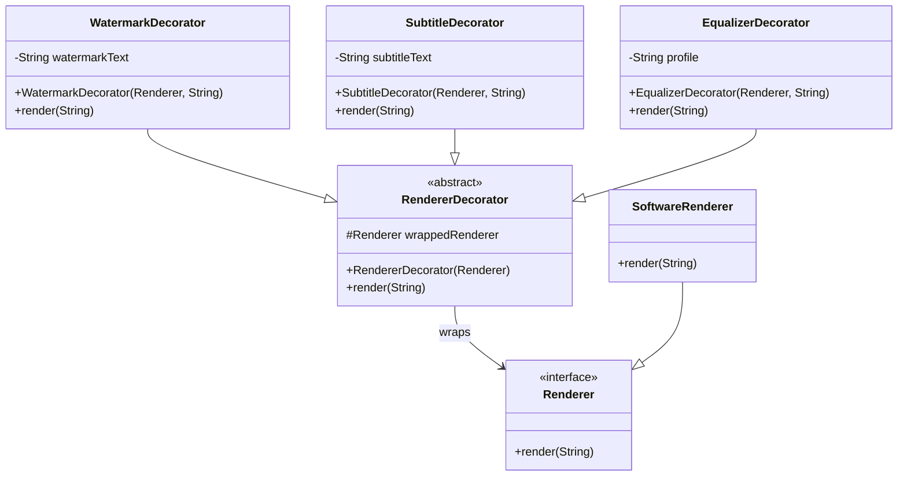
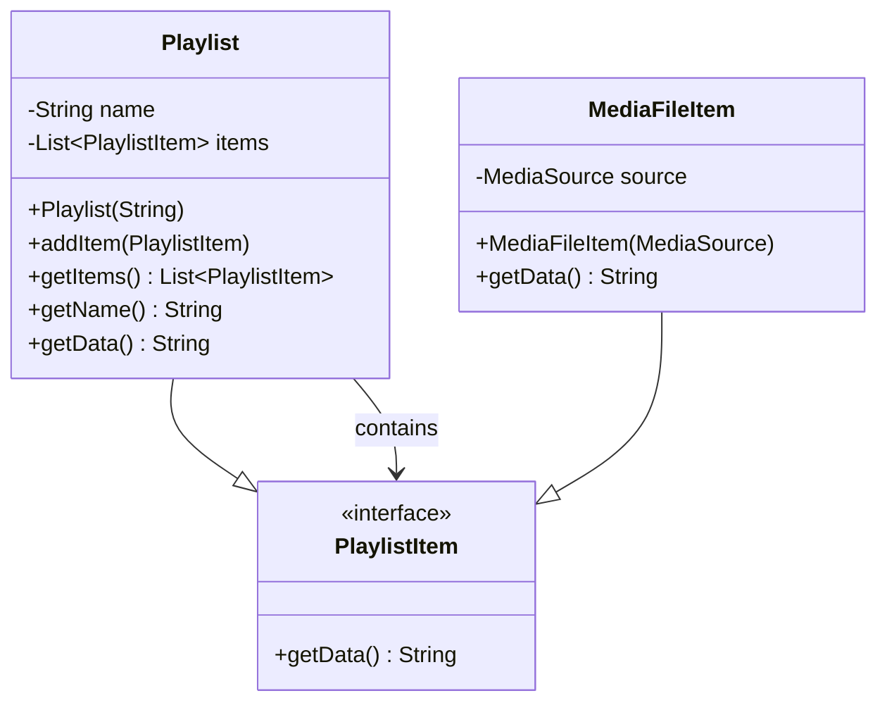
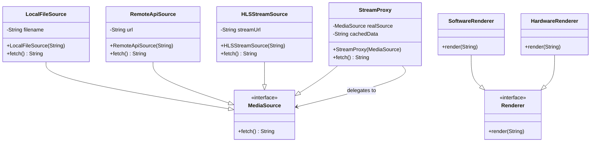
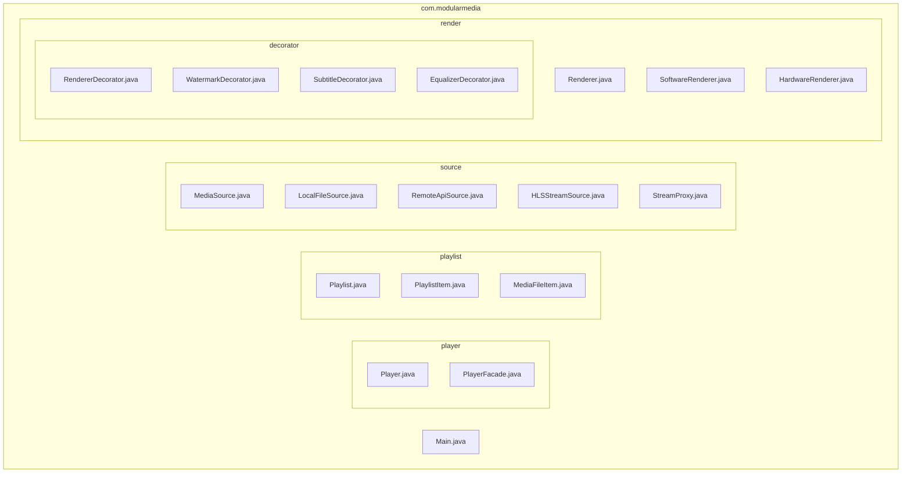

# UML Class Diagrams

## Main System Class Diagram

```mermaid
classDiagram
    class Main {
        +main(String[] args)
    }
    
    class PlayerFacade {
        -Player player
        -Playlist playlist
        +PlayerFacade(Renderer)
        +setRenderer(Renderer)
        +loadPlaylist(Playlist)
        +playAll()
    }
    
    class Player {
        -Renderer renderer
        +Player(Renderer)
        +setRenderer(Renderer)
        +play(PlaylistItem)
    }
    
    class Playlist {
        -String name
        -List~PlaylistItem~ items
        +Playlist(String)
        +addItem(PlaylistItem)
        +getItems() List~PlaylistItem~
        +getName() String
        +getData() String
    }
    
    class PlaylistItem {
        <<interface>>
        +getData() String
    }
    
    class MediaFileItem {
        -MediaSource source
        +MediaFileItem(MediaSource)
        +getData() String
    }
    
    class MediaSource {
        <<interface>>
        +fetch() String
    }
    
    class LocalFileSource {
        -String filename
        +LocalFileSource(String)
        +fetch() String
    }
    
    class RemoteApiSource {
        -String url
        +RemoteApiSource(String)
        +fetch() String
    }
    
    class HLSStreamSource {
        -String streamUrl
        +HLSStreamSource(String)
        +fetch() String
    }
    
    class StreamProxy {
        -MediaSource realSource
        -String cachedData
        +StreamProxy(MediaSource)
        +fetch() String
    }
    
    class Renderer {
        <<interface>>
        +render(String)
    }
    
    class SoftwareRenderer {
        +render(String)
    }
    
    class HardwareRenderer {
        +render(String)
    }
    
    class RendererDecorator {
        <<abstract>>
        #Renderer wrappedRenderer
        +RendererDecorator(Renderer)
        +render(String)
    }
    
    class WatermarkDecorator {
        -String watermarkText
        +WatermarkDecorator(Renderer, String)
        +render(String)
    }
    
    class SubtitleDecorator {
        -String subtitleText
        +SubtitleDecorator(Renderer, String)
        +render(String)
    }
    
    class EqualizerDecorator {
        -String profile
        +EqualizerDecorator(Renderer, String)
        +render(String)
    }
    
    %% Relationships
    Main --> PlayerFacade
    Main --> Playlist
    Main --> MediaSource
    Main --> Renderer
    
    PlayerFacade --> Player
    PlayerFacade --> Playlist
    Player --> Renderer
    Player --> PlaylistItem
    
    Playlist --|> PlaylistItem
    MediaFileItem --|> PlaylistItem
    MediaFileItem --> MediaSource
    
    LocalFileSource --|> MediaSource
    RemoteApiSource --|> MediaSource
    HLSStreamSource --|> MediaSource
    StreamProxy --|> MediaSource
    StreamProxy --> MediaSource
    
    SoftwareRenderer --|> Renderer
    HardwareRenderer --|> Renderer
    RendererDecorator --|> Renderer
    RendererDecorator --> Renderer
    
    WatermarkDecorator --|> RendererDecorator
    SubtitleDecorator --|> RendererDecorator
    EqualizerDecorator --|> RendererDecorator
```

## Decorator Pattern Detail

```mermaid
classDiagram
    class Renderer {
        <<interface>>
        +render(String)
    }
    
    class SoftwareRenderer {
        +render(String)
    }
    
    class RendererDecorator {
        <<abstract>>
        #Renderer wrappedRenderer
        +RendererDecorator(Renderer)
        +render(String)
    }
    
    class WatermarkDecorator {
        -String watermarkText
        +WatermarkDecorator(Renderer, String)
        +render(String)
    }
    
    class SubtitleDecorator {
        -String subtitleText
        +SubtitleDecorator(Renderer, String)
        +render(String)
    }
    
    class EqualizerDecorator {
        -String profile
        +EqualizerDecorator(Renderer, String)
        +render(String)
    }
    
    %% Decorator relationships
    RendererDecorator --> Renderer : wraps
    WatermarkDecorator --|> RendererDecorator
    SubtitleDecorator --|> RendererDecorator
    EqualizerDecorator --|> RendererDecorator
    
    SoftwareRenderer --|> Renderer
```

## Composite Pattern Detail

```mermaid
classDiagram
    class PlaylistItem {
        <<interface>>
        +getData() String
    }
    
    class Playlist {
        -String name
        -List~PlaylistItem~ items
        +Playlist(String)
        +addItem(PlaylistItem)
        +getItems() List~PlaylistItem~
        +getName() String
        +getData() String
    }
    
    class MediaFileItem {
        -MediaSource source
        +MediaFileItem(MediaSource)
        +getData() String
    }
    
    %% Composite relationships
    Playlist --|> PlaylistItem
    MediaFileItem --|> PlaylistItem
    Playlist --> PlaylistItem : contains
```

## Strategy Pattern Detail

```mermaid
classDiagram
    class MediaSource {
        <<interface>>
        +fetch() String
    }
    
    class LocalFileSource {
        -String filename
        +LocalFileSource(String)
        +fetch() String
    }
    
    class RemoteApiSource {
        -String url
        +RemoteApiSource(String)
        +fetch() String
    }
    
    class HLSStreamSource {
        -String streamUrl
        +HLSStreamSource(String)
        +fetch() String
    }
    
    class StreamProxy {
        -MediaSource realSource
        -String cachedData
        +StreamProxy(MediaSource)
        +fetch() String
    }
    
    class Renderer {
        <<interface>>
        +render(String)
    }
    
    class SoftwareRenderer {
        +render(String)
    }
    
    class HardwareRenderer {
        +render(String)
    }
    
    %% Strategy relationships
    LocalFileSource --|> MediaSource
    RemoteApiSource --|> MediaSource
    HLSStreamSource --|> MediaSource
    StreamProxy --|> MediaSource
    StreamProxy --> MediaSource : delegates to
    
    SoftwareRenderer --|> Renderer
    HardwareRenderer --|> Renderer
```

## Package Structure

```mermaid
graph TB
    subgraph "com.modularmedia"
        Main[Main.java]
        
        subgraph "player"
            Player[Player.java]
            PlayerFacade[PlayerFacade.java]
        end
        
        subgraph "playlist"
            Playlist[Playlist.java]
            PlaylistItem[PlaylistItem.java]
            MediaFileItem[MediaFileItem.java]
        end
        
        subgraph "source"
            MediaSource[MediaSource.java]
            LocalFileSource[LocalFileSource.java]
            RemoteApiSource[RemoteApiSource.java]
            HLSStreamSource[HLSStreamSource.java]
            StreamProxy[StreamProxy.java]
        end
        
        subgraph "render"
            Renderer[Renderer.java]
            SoftwareRenderer[SoftwareRenderer.java]
            HardwareRenderer[HardwareRenderer.java]
            
            subgraph "decorator"
                RendererDecorator[RendererDecorator.java]
                WatermarkDecorator[WatermarkDecorator.java]
                SubtitleDecorator[SubtitleDecorator.java]
                EqualizerDecorator[EqualizerDecorator.java]
            end
        end
    end
```
