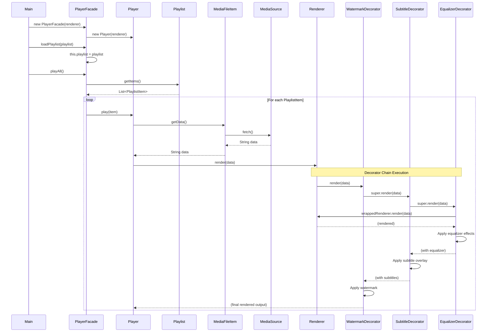
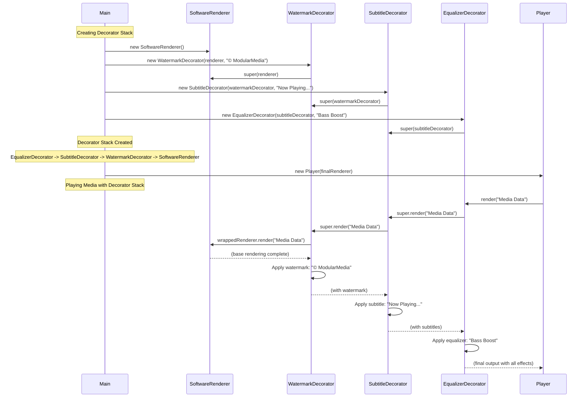
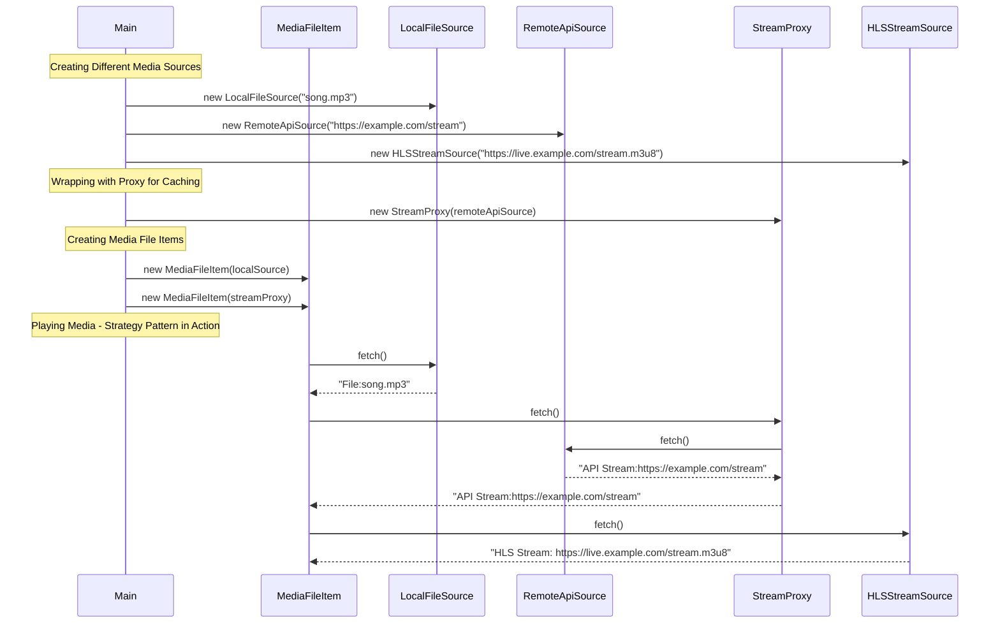
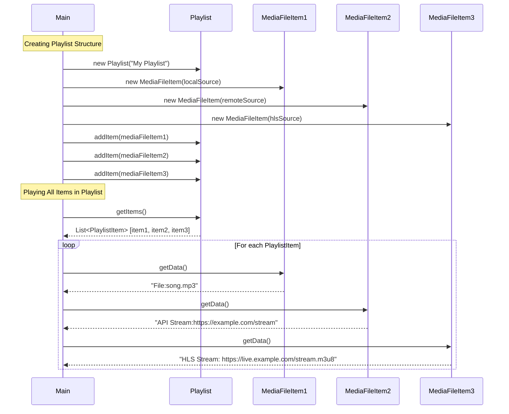
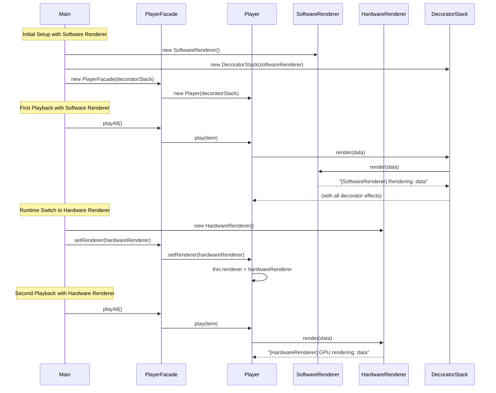

# Sequence Diagrams

## 1. Play Media Flow

This sequence diagram shows the complete flow when playing media through the system:

## 2. Apply Decorator Stack Flow

This sequence diagram shows how decorators are applied and how they work together:

## 3. Media Source Strategy Selection

This sequence diagram shows how different media sources are used:

## 4. Playlist Composite Structure

This sequence diagram shows how the composite pattern works with playlists:

## 5. Runtime Renderer Switching

This sequence diagram shows how the system can switch renderers at runtime:

